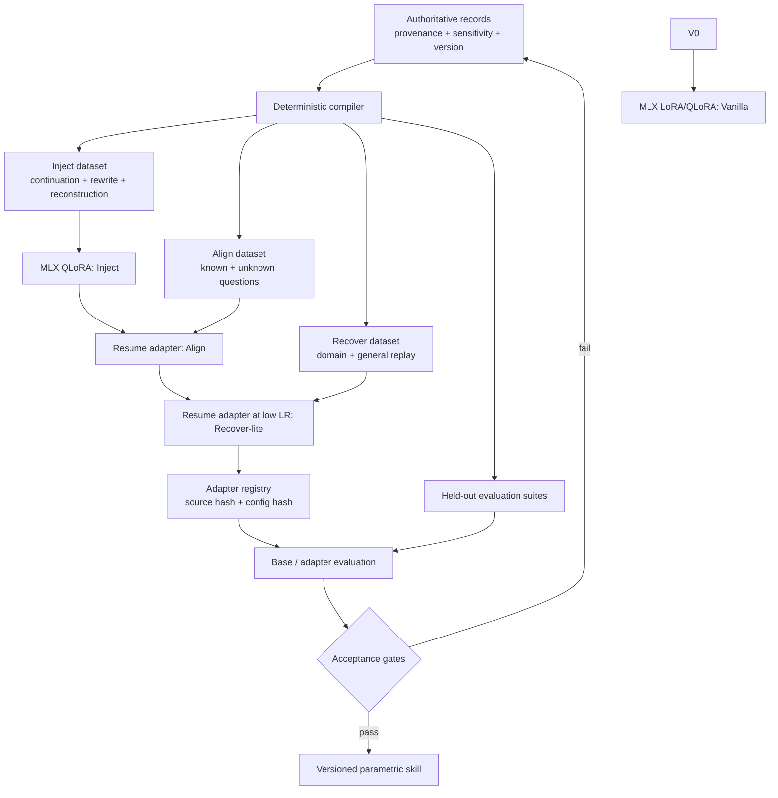

# Architecture

## Source and compiled artefact

The knowledge record is analogous to source code; the adapter is a compiled artefact. A policy change therefore creates a new knowledge snapshot, new datasets, a newly trained adapter and a complete regression run. The old adapter remains immutable for audit and rollback.

## Three knowledge channels

| Channel | Suitable content |
|---|---|
| Base model | language and broad general capabilities |
| Versioned adapter | stable terminology, repeated judgement patterns, bounded internal rules shared with every authorised adapter user |
| Live context/tool | current records, permissions, transactions, evidence, changing policies and anything requiring exact attribution |

## Domain adapter bank

`emmlx compile` creates domain-specific datasets. Domain adapters are trained independently from the same base model. This avoids merging unrelated departments into one ever-changing adapter, but it creates a routing problem. The included router is intentionally explicit and returns `context_required` below a confidence threshold.
