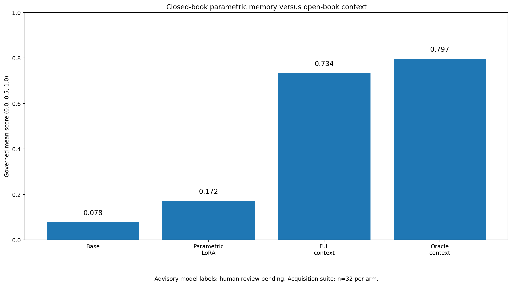

# Advisory smoke result — 1 September 2026

## Status

This is the public summary of a completed, blinded **model-review advisory**
over the corrected acquisition smoke benchmark. It is **not** a
human-complete evaluation, judge certification, promotion decision, or
confirmatory result.

Formal status:

```text
human_review_pending
promotion_eligible: false
```

Labels were produced by a model reviewer (`GPT-5.6 Sol (Cursor)`) working
only from the arm-blinded packet: no arm identity, question IDs,
deterministic outcomes, retrieval metadata, or source records were visible
during scoring. Deterministic hard failures were re-applied after unblinding
and cannot be upgraded by any semantic label. 18 of 160 cases were flagged
by the reviewer as needing human attention.

## Artifact chain (SHA-256)

The generated runtime artifacts remain local and are intentionally excluded
from this repository. Every number below is bound to these hashes so a local
copy can be verified byte-for-byte:

| Artifact | SHA-256 |
|---|---|
| Raw benchmark (`benchmark-20260901T101652Z.json`) | `3a6c0f6e5415e471ce29a5198958fead7c82db9fa5be1e6d3bd7a628ce0da6c2` |
| Deterministic grading report | `9a590ea184b05b8592a0ec9ec1ceb8f072abc34acf58b47bc98e2e36b87bba3f` |
| Blinded review packet (160 cases) | `92e6180d92d39a9a4185de8a4922fe57b4fa72ecdab12cf8c36e44fe88bea8cb` |
| Private review-ID mapping | `8c87684843675f39660f23aadb0b9564fc5366c5c51e90fed74fcef767ad25e3` |
| Merged model labels | `13a8d13d524d487c586714adf79d629707c63fd258a984f2b3e2fa921b4ff95d` |

## Candidate

- Model: `mlx-community/Qwen3-4B-Instruct-2507-4bit`
  (revision `50d427756c6b1b2fe0c0a10f67fbda1fc8e82c1b`)
- Framework: MLX-LM
- Hardware: one M4 Max Mac, 128GB unified memory
- Adapter: LoRA rank 16, MLX scale 2.0
- Layers: all 36; targets: q/k/v/o and gate/up/down projections
- Adapter hash: `a3bb1b6ca4ed693365b5dc91778ef794feaee8dc4a04cd2c07430efcd05f9634`
- Seed: one
- Study-view families per fact: 10 (repeated across epochs)
- Target exposures per fact: 24 (realized: 30, whole-epoch rounding)
- Whole-corpus epochs: 3; micro-iterations: 240; optimizer updates: 30
- Promotion eligibility: false

## Advisory governed scores

Governed scores preserve deterministic hard failures at 0.0 regardless of
the semantic label. n = 32 acquisition questions per arm. Confidence
intervals are descriptive two-sided 95% Clopper–Pearson bounds on the
fully-correct rate; at n = 32 they are wide.

| Arm | Hard fails | Mean score | Fully correct | Fully-correct rate (95% CI) |
|---|---:|---:|---:|---|
| Base | 28 | 0.078 | 2/32 | 0.063 (0.008–0.208) |
| Parametric LoRA | 23 | 0.172 | 3/32 | 0.094 (0.020–0.250) |
| Experimental BM25 | 21 | 0.312 | 9/32 | 0.281 (0.137–0.467) |
| Full context | 7 | 0.734 | 22/32 | 0.688 (0.500–0.839) |
| Oracle context | 4 | 0.797 | 23/32 | 0.719 (0.533–0.863) |

The experimental BM25 arm uses an owner-approved, explicitly
`experimental_non_promotable` operating point; its own validation study
found **no production-feasible** lexical operating point. It is a research
control, not a deployable retriever.



Paired parametric versus base (governed scores, 32 questions):

```text
wins:   6
losses: 2
ties:   24
```

## Pre-registered continuation rule

The rule was hash-bound into the blinded packet before any label existed.
The candidate had to pass all three:

| Criterion | Observed | Required | Advisory result |
|---|---:|---:|---|
| Mean improvement over base | 0.09375 | at least 0.10 | fail |
| Additional fully correct cases | 1 | at least 4 | fail |
| Paired wins exceed losses | 6 > 2 | yes | pass |

Apparent result if the labels had been accepted human labels:

```text
stop_parametric_research
```

Operative result under the implemented governance boundary:

```text
human_review_pending
```

The threshold is not renegotiable after observing that 0.09375 is close to
0.10; a stopping rule that moves when a result nearly passes is not a
stopping rule.

## Interpretation

Stop this adapter candidate. Keep full context as the operational winner for
the current small corpus, and investigate validated embedding or hybrid
retrieval as the corpus grows.

Parametric acquisition remains unproven, not disproved. This candidate used
the revised all-linear substrate; the unresolved weakness is evidence
quality, not parameterization. Reopening the research requires materially
better inputs: at least 24 genuinely independent study views per fact,
multiple seeds, enough independent facts for useful confidence bounds, and
real human evaluation.
